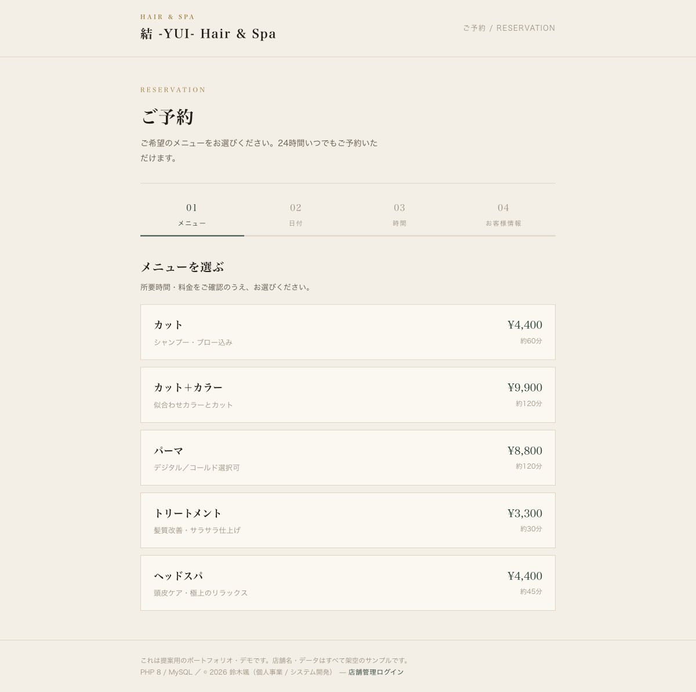
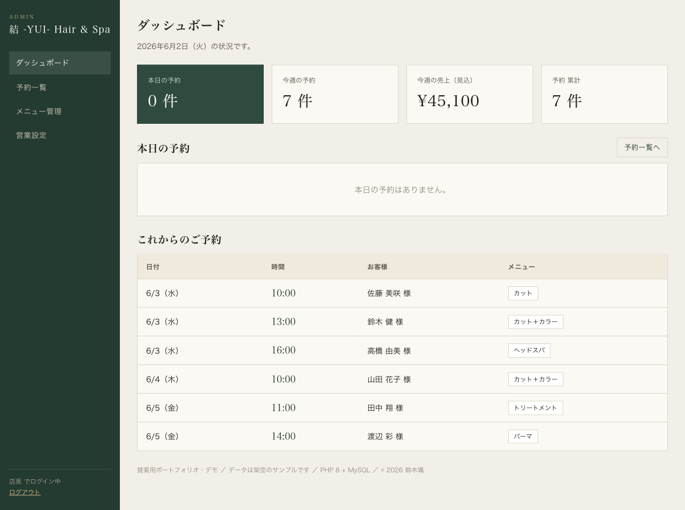

# 予約システム（PHP + MySQL）

店舗向けの **ネット予約システム** です。お客様のネット予約から、店舗側の予約管理・メニュー管理・営業設定までを備えた、**PHP 8 + MySQL** によるサーバーサイドの実装です。

> 注意：これは PHP/MySQL で動くアプリのため、GitHub Pages では動きません。
> ライブデモは PHP が動くレンタルサーバー／共有ホスティングに設置してご覧ください（手順は下記）。

| お客様：ネット予約 | 店舗：管理ダッシュボード |
|---|---|
|  |  |

## 画面
**お客様（公開ページ）**
- メニュー選択 → 日付（空き状況 ◯△×）→ 時間枠 → お客様情報 → 予約完了
- 予約番号の発行

**店舗管理（要ログイン `/admin/`）**
- ダッシュボード（本日／今週の予約・売上見込・累計）
- 予約一覧（日付別・確定／来店済／取消）
- メニュー管理（追加・編集・公開/非公開・削除）
- 営業設定（営業時間・予約間隔・席数・定休日）

## 技術ポイント（重視した点）
- **PDO プリペアドステートメント**で全SQLを実行（SQLインジェクション対策）
- **CSRFトークン**を全フォームで検証
- **パスワードは `password_hash`（bcrypt）**で保存・`password_verify`で照合、必要時に自動再ハッシュ
- **セッション固定化対策**（ログイン時 `session_regenerate_id`）、Cookieは HttpOnly / SameSite / 本番Secure
- **二重予約の防止**：予約確定をトランザクション＋`SELECT ... FOR UPDATE` で排他制御
- 出力は全て `htmlspecialchars` でエスケープ（XSS対策）、サーバー側バリデーション
- 営業時間・所要時間・席数・定休日を考慮した**空き枠の自動計算**
- `includes/`・`sql/` は `.htaccess` で直接アクセス禁止

## 技術スタック
- PHP 8（フレームワーク不使用・素のPHPで構造化）／ MySQL 8（InnoDB・外部キー）
- 依存ライブラリなし。共有ホスティングにそのまま設置可能。

## セットアップ
```bash
# 1) データベースを作成
mysql -u root -p -e "CREATE DATABASE yoyaku CHARACTER SET utf8mb4 COLLATE utf8mb4_unicode_ci;"

# 2) スキーマ＋初期データを投入
mysql -u root -p yoyaku < sql/schema.sql

# 3) 設定ファイルを用意して接続情報を編集
cp includes/config.sample.php includes/config.php
#   → includes/config.php の db.user / db.pass などを設定

# 4) 動作確認（ローカル）
php -S localhost:8000
#   お客様画面: http://localhost:8000/
#   店舗管理  : http://localhost:8000/admin/
```

### デモ用ログイン
- メール：`admin@yui-salon.example`
- パスワード：`yui-admin-2026`

## 共有ホスティングへの設置
1. ファイル一式を公開ディレクトリ（例：`/yoyaku/`）へアップロード
2. サーバーのMySQLにデータベースを作成し、`sql/schema.sql` を投入
3. `includes/config.sample.php` を `config.php` にコピーし、接続情報を設定
4. `https://（ご自身のドメイン）/yoyaku/` でお客様画面、`/yoyaku/admin/` で管理画面

## ファイル構成
```
index.php          お客様：メニュー選択
booking.php        お客様：日付→時間→情報入力→確定（バリデーション・排他制御）
complete.php       お客様：予約完了
admin/             店舗管理（login / dashboard / bookings / services / settings）
includes/          bootstrap・DB(PDO)・認証・CSRF・ヘルパ・レイアウト（直接アクセス禁止）
assets/            style.css（顧客）・admin.css（管理）
sql/schema.sql     スキーマ＋初期データ
```

## 補足
店舗名・メニュー・データはすべて架空のサンプルです。設定値（店名・営業時間・メニュー）を変えるだけで、別店舗向けに再利用できます。実装版では確認メール／SMS送信、事前決済、複数スタッフ対応、Googleカレンダー連携などを追加できます。

---
© 2026 鈴木颯（個人事業 / システム開発）
